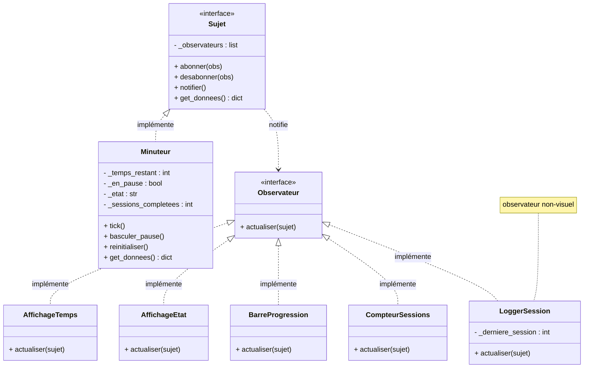

# Diagramme UML — Projet A : Minuteur Pomodoro

Ce diagramme montre l'architecture cible à implémenter dans la branche `refactor`.

```mermaid
classDiagram
    class Sujet {
        <<interface>>
        - _observateurs : list
        + abonner(obs)
        + desabonner(obs)
        + notifier()
        + get_donnees() dict
    }

    class Observateur {
        <<interface>>
        + actualiser(sujet)
    }

    class Minuteur {
        - _temps_restant : int
        - _en_pause : bool
        - _etat : str
        - _sessions_completees : int
        + tick()
        + basculer_pause()
        + reinitialiser()
        + get_donnees() dict
    }

    class AffichageTemps {
        + actualiser(sujet)
    }

    class AffichageEtat {
        + actualiser(sujet)
    }

    class BarreProgression {
        + actualiser(sujet)
    }

    class CompteurSessions {
        + actualiser(sujet)
    }

    class LoggerSession {
        - _derniere_session : int
        + actualiser(sujet)
    }

    note for LoggerSession "observateur non-visuel"

    Sujet <|.. Minuteur : implémente
    Observateur <|.. AffichageTemps : implémente
    Observateur <|.. AffichageEtat : implémente
    Observateur <|.. BarreProgression : implémente
    Observateur <|.. CompteurSessions : implémente
    Observateur <|.. LoggerSession : implémente
    Sujet ..> Observateur : notifie
```
